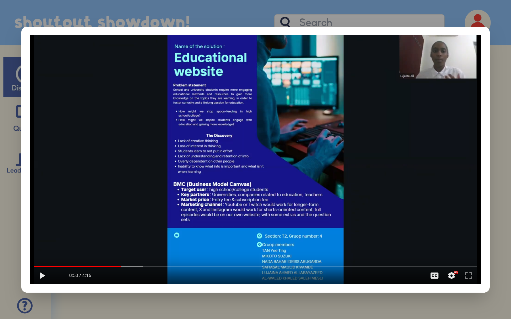
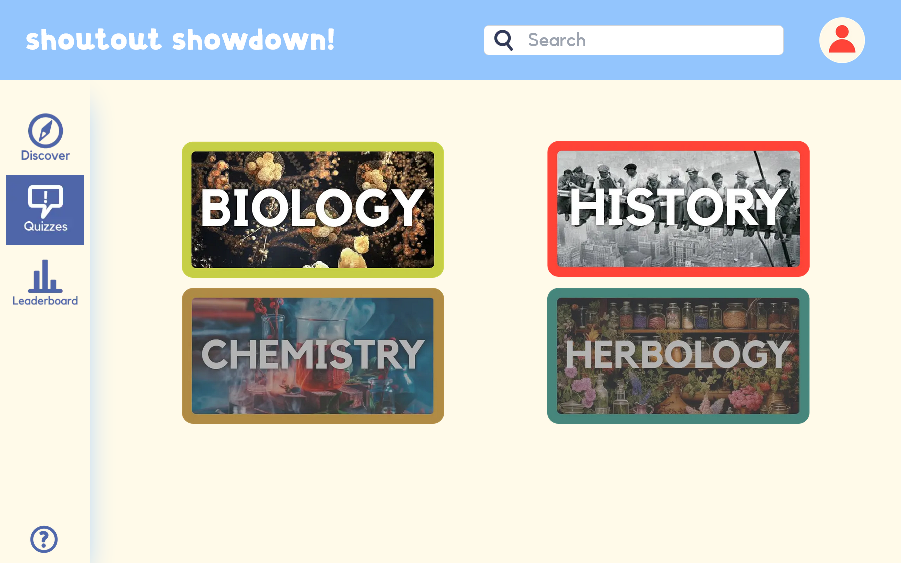
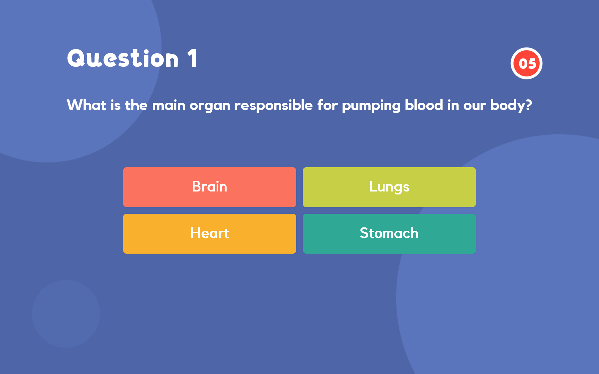
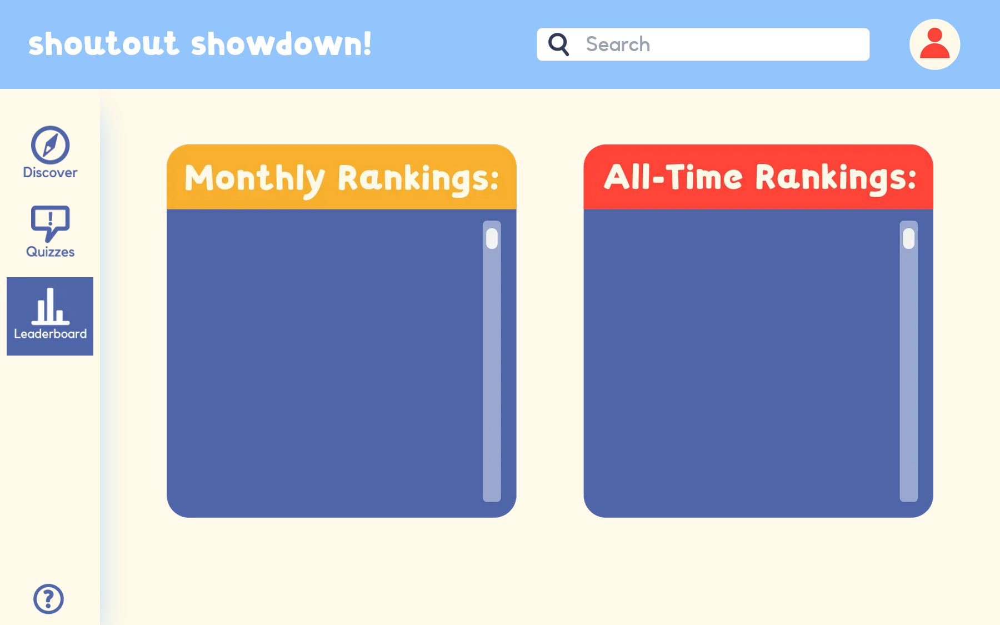

# Shoutout Showdown

This is a [Next.js](https://nextjs.org/) project commissioned by [Kiha](https://www.instagram.com/kihakiha_/), it is an educational website that allows interactive learning.
Art assets and idea done by her, website & code by me! Do note the website is non-responsive (non-mobile friendly), and it's best used on a 1980x1080 resolution laptop, due to time constraints.

## Showcase

Login page (only login as guest works)

Discovery page (only a video)

The video is watchable

Quizzes page (only Biology and History is available)

Quiz with timer

Quiz score after 10 questions

Leaderboard page (non-functional)


## What works

1. Discovery page: Meant to have educational videos to watch, it currently has a video to play.
2. Quizzes: Only Biology and History quizzes are available, each quiz has 10 questions, 10 seconds each.

Others are just there for reference, this project is merely a proof of concept.

## Running on your machine

Run the development server:

```bash
npm run dev
```

Open [http://localhost:8080](http://localhost:8080) with your browser to see the result.

## Credits

Art and idea by [Kiha](https://www.instagram.com/kihakiha_/), big thanks to her commissioning me and supplying me with the website's art and ideas!
